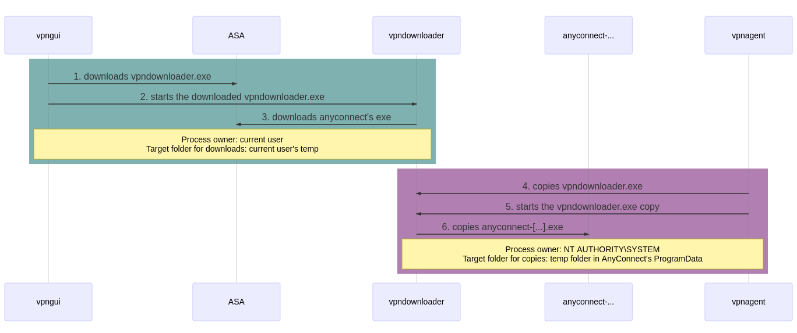
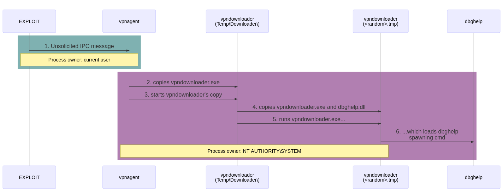
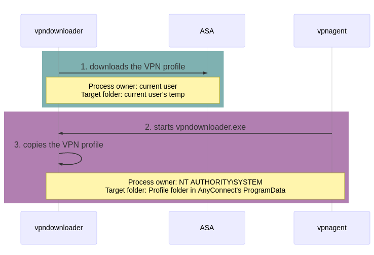
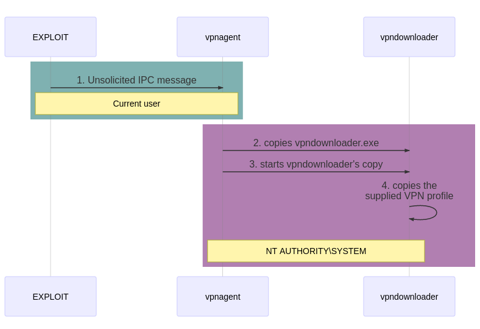

# Discovering new vulnerabilities in Cisco AnyConnect Secure Mobility Client for Windows

Antoine Goichot - September 2020 

[GitHub](https://github.com/goichot) | [Twitter](https://twitter.com/AntoineGoichot) | [LinkedIn](https://www.linkedin.com/in/antoinegoichot)


## Table of Contents

1. [Introduction](#introduction)
2. [Disclaimer](#disclaimer)
3. [Cisco AnyConnect auto-update](#cisco-anyconnect-auto-update)
4. [CVE-2020-3433 - Privilege Escalation](#cve-2020-3433---privilege-escalation)
5. [CVE-2020-3434 - Denial of Service](#cve-2020-3434---denial-of-service)
6. [CVE-2020-3435 - VPN "Always-On" bypass](#cve-2020-3435---vpn-always-on-bypass)
7. [Conclusion](#conclusion)
9. [References](#references)


## Introduction

End of April 2020, I analyzed the technical advisory from [SSD Secure Disclosure](https://ssd-disclosure.com/ssd-advisory-cisco-anyconnect-privilege-elevation-through-path-traversal/) on the CVE-2020-3153 vulnerability affecting Cisco AnyConnect Secure Mobility Client for Windows (discovered by [Yorick Koster](https://twitter.com/yorickkoster)). During this analysis, I found three additional vulnerabilities in the same component. Beginning of May 2020, I sent all details to Cisco (responsible disclosure), and these vulnerabilities are now public since beginning of August 2020.

The purpose of this post is to describe these new vulnerabilities:

- CVE-2020-3433 - High (CVSS Score 7.8) - a local privilege escalation - [Cisco Advisory](https://tools.cisco.com/security/center/content/CiscoSecurityAdvisory/cisco-sa-anyconnect-dll-F26WwJW)
- CVE-2020-3434 - Medium (CVSS Score 5.5) - a Denial of Service - [Cisco Advisory](https://tools.cisco.com/security/center/content/CiscoSecurityAdvisory/cisco-sa-anyconnect-dos-feXq4tAV)
- CVE-2020-3435 - Medium (CVSS Score 5.5) - an "Always-On" bypass (VPN profile modification) - [Cisco Advisory](https://tools.cisco.com/security/center/content/CiscoSecurityAdvisory/cisco-sa-anyconnect-profile-7u3PERKF)

I wrote a Proof of Concept for the CVE-2020-3153 that I released in May 2020 on [GitHub](https://github.com/goichot/CVE-2020-3153/). In addition to my code, I wrote a complete technical analysis of this previous vulnerability that can be found on [GitHub](https://github.com/goichot/CVE-2020-3153/blob/master/details.md) or on [my website](https://www.redteam.lu/posts/2020/05/writing-an-exploit-for-cve-2020-3153/). I suggest to read this previous write-up as an introduction to this post, especially the sections named "Cisco AnyConnect Auto-Update", "AnyConnect IPC protocol" and "Side note on vpndownloader commands". In any case, a description of AnyConnect's main components and its auto-update process are available after the disclaimer.


## Disclaimer

- My Proof of Concepts were successfully tested on Windows 10 (1909) with the following versions of AnyConnect (x86):
  - 4.5.02036
  - 4.6.03049
  - 4.8.03036 (released on the 16-Mar-2020)
  - 4.8.03052 (released on the 23-Apr-2020)
- The privilege escalation vulnerability (CVE-2020-3433) was fixed in the version 4.9.00086, released on the 18-Jun-2020 (before the publication of Cisco's security advisories).
- The Denial of Service (CVE-2020-3434) seems to be fixed in version 4.9.01095, but not the "Always-On" bypass (CVE-2020-3435).
- Cisco AnyConnect 64-bit versions have not been tested. Some adjustments are probably needed (e.g. path to `vpndownloader.exe`).


## Cisco AnyConnect auto-update

According to [Cisco's documentation](https://www.cisco.com/c/en/us/td/docs/security/vpn_client/anyconnect/anyconnect40/administration/guide/b_AnyConnect_Administrator_Guide_4-0/deploy-anyconnect.html#ID-1425-0000044e), AnyConnect can be updated in several ways, and, in particular, using an auto-update feature. Such feature has already been affected by several vulnerabilities in the past few years (including the mentioned CVE-2020-3153), and now, the three vulnerabilities detailed in this post.

AnyConnect is composed of numerous executables and libraries but the two main components are: 

- `vpnagent.exe` - Cisco AnyConnect Secure Mobility Agent, a service running as Local System account; 
- `vpnui.exe` - AnyConnect GUI, running as the current logged user.

The GUI and other components (particularly in our case, the "downloader" component - `vpndownloader.exe`) of this solution communicate with the VPN agent thanks to an Inter-Process Communication (IPC) mechanism on the TCP port 62522 (loopback network interface only).
Therefore, it's possible to capture these communications by sniffing the loopback interface with Wireshark. Since the content is not encrypted, the main purpose of each message can be understood or at least guessed.

The AnyConnect IPC protocol has already been studied, in particular in SerializingMe's article [part 1](https://www.serializing.me/2016/12/14/anyconnect-elevation-of-privileges-part-1/) and [part 2](https://www.serializing.me/2016/12/20/anyconnect-elevation-of-privileges-part-2/), and several exploits (ab)using this protocol were made available (e.g. [Google Project Zero PoC for CVE-2015-6305](https://bugs.chromium.org/p/project-zero/issues/detail?id=460)).

By performing some basic reverse engineering on `vpndownloader.exe`, the following "CAC" (for <u>C</u>isco <u>A</u>ny<u>C</u>onnect?) commands can be found:

- `CAC-move`
- `CAC-vcredist-install`
- `CAC-re-launch`
- `CAC-nc-install`

By using Sysinternals' Process Monitor (ProcMon) at the same time, numerous events are recorded when AnyConnect is updated using the embedded feature. The following ones are the most important (based on an auto-update from AnyConnect 4.5.02036 to 4.6.03049):

1. `vpndownloader.exe` is downloaded by `vpnui.exe` (running as the current user, `ATGO`) from the ASA gateway to `C:\Users\ATGO\AppData\Local\Temp\D378.tmp\vpndownloader.exe`

2. `vpndownloader.exe` (downloaded in step 1) is started with the current user (`ATGO`) privileges (process created by `vpnui.exe`) with the following command: `"C:\Users\ATGO\AppData\Local\Temp\D378.tmp\vpndownloader.exe" "-ipc gc"` 

3. `anyconnect-win-4.6.03049-core-vpn-webdeploy-k9.exe` is downloaded (by `vpndownloader.exe`) from the ASA gateway to `C:\Users\ATGO\AppData\Local\Temp\Cisco\25869.tmp\anyconnect-win-4.6.03049-core-vpn-webdeploy-k9.exe`

4. `vpnagent.exe` copies `vpndownloader.exe` from `C:\Users\ATGO\AppData\Local\Temp\D378.tmp\vpndownloader.exe` to `C:\ProgramData\Cisco\Cisco AnyConnect Secure Mobility Client\Temp\Downloader\vpndownloader.exe`

5. The copied `vpndownloader.exe` is started by `vpnagent.exe` as `NT AUTHORITY\SYSTEM` with the following command: `"C:\ProgramData\Cisco\Cisco AnyConnect Secure Mobility Client\Temp\Downloader\vpndownloader.exe" "CAC-re-launch C:\Users\ATGO\AppData\Local\Temp\Cisco\25869.tmp\anyconnect-win-4.6.03049-core-vpn-webdeploy-k9.exe -" ` 

6. `anyconnect-win-4.6.03049-core-vpn-webdeploy-k9.exe` is copied to `C:\ProgramData\Cisco\Cisco AnyConnect Secure Mobility Client\Temp\Installer\23342.tmp\` and then the installation of AnyConnect 4.6.03049 begins.

These steps are summarized in the following diagram:

<p align="center">
  
</p>


## CVE-2020-3433 - Privilege Escalation

**Description:**
> A vulnerability in the interprocess communication (IPC) channel of Cisco AnyConnect Secure Mobility Client for Windows could allow an authenticated, local attacker to perform a DLL hijacking attack. To exploit this vulnerability, the attacker would need to have valid credentials on the Windows system.
> 
> The vulnerability is due to insufficient validation of resources that are loaded by the application at run time. An attacker could exploit this vulnerability by sending a crafted IPC message to the AnyConnect process. A successful exploit could allow the attacker to execute arbitrary code on the affected machine with SYSTEM privileges. To exploit this vulnerability, the attacker would need to have valid credentials on the Windows system.

**CVSS Score:** 7.8 (High)

[Cisco Advisory](https://tools.cisco.com/security/center/content/CiscoSecurityAdvisory/cisco-sa-anyconnect-dll-F26WwJW)


### Understanding of all parameters in the auto-update process

The key steps of AnyConnect auto-update have already been described in a previous section, but let's focus on the two last steps:

> 5. The copied `vpndownloader.exe` is started by `vpnagent.exe` as `NT AUTHORITY\SYSTEM` with the following command: 
`"C:\ProgramData\Cisco\Cisco AnyConnect Secure Mobility Client\Temp\Downloader\vpndownloader.exe" "CAC-re-launch C:\Users\ATGO\AppData\Local\Temp\Cisco\25869.tmp\anyconnect-win-4.6.03049-core-vpn-webdeploy-k9.exe -" ` 
> 
> 6. `anyconnect-win-4.6.03049-core-vpn-webdeploy-k9.exe` is copied to `C:\ProgramData\Cisco\Cisco AnyConnect Secure Mobility Client\Temp\Installer\23342.tmp\` and then the installation of AnyConnect 4.6.03049 begins.

I was wondering the purpose of the dash (`-`) in the command of the 5<sup>th</sup> step. I thought it could be a filename, so I tried to send the following command:

`CAC-nc-install -ipc=1337 C:\Windows\System32\cmd.exe C:\Windows\System32\calc.exe`.

Note: as already mentioned in my previous post, the `-ipc=<port>` argument is needed on AnyConnect 4.7.x and later. I used `CAC-nc-install` instead of `CAC-re-launch` to avoid the stop of `vpnagent.exe`(cf. [CVE-2020-3434 - Denial of Service](#cve-2020-3434---denial-of-service) section).

By following the events in ProcMon while sending an IPC message with this command, I noticed that **both files** were copied in the **same** `C:\ProgramData\Cisco\Cisco AnyConnect Secure Mobility Client\Temp\Installer\<random>.tmp` folder **before being deleted**.

By looking in Windows Event Viewer, the following error was logged:

> Signature verification failed for file C:\ProgramData\Cisco\Cisco AnyConnect Secure Mobility Client\Temp\Installer\2120.tmp\cmd.exe

This error was expected since AnyConnect checks signature of executables in its auto-update process. Binaries need to have a valid signature from `Cisco Systems, Inc` to be executed. **However, no mention of `calc.exe` in the logs and no error regarding invalid arguments!**

So, I tried again by replacing `cmd.exe` by `vpndownloader.exe`, since this binary is signed by Cisco (and since I already used this binary in my exploit fro CVE-2020-3153). Thus, I sent an IPC message with the following command:

`CAC-nc-install -ipc=1337 C:\Program Files (x86)\Cisco\Cisco AnyConnect Secure Mobility Client\vpndownloader.exe C:\Windows\System32\calc.exe`.

In ProcMon, once again, **both**  `vpndownloader.exe` and `calc.exe` were copied to the **same** `<random>.tmp` folder, and a process of `vpndowloader.exe` spawned as `NT AUTHORITY\SYSTEM` from this folder (as it is a Cisco-signed binary).

As expected, the signature check succeeded and it can be observed in Windows Event logs:

> Code-signing verification succeeded. File (C:\ProgramData\Cisco\Cisco AnyConnect Secure Mobility Client\Temp\Installer\18666.tmp\vpndownloader.exe)

**However, still no mention of `calc.exe` in the logs!**


### Discovering a new privilege escalation vulnerability

`vpndownloader.exe` is affected by a DLL hijacking vulnerability: this program is looking for a DLL named `dbghelp.dll` (this behavior was exploited in my PoC for CVE-2020-3153), so I sent a new IPC message with `vpndownloader.exe` as the first parameter, but I replaced the second parameter by the path to a malicious `dbghelp.dll` (the one from [Google Project Zero PoC for CVE-2015-6305](https://bugs.chromium.org/p/project-zero/issues/detail?id=460) that I already used for my exploit for CVE-2020-3153).

This time, an elevated command prompt spawned as `NT AUTHORITY\SYSTEM` on the desktop of the regular user!

As already mentioned, before AnyConnect launches a binary, it checks if the signature of this binary is from `Cisco Systems, Inc`. **However, AnyConnect did not check the signature of a second file in argument!** This issue is fixed in AnyConnect 4.9.00086.

I quickly developed an exploit for this vulnerability by modifying my code for CVE-2020-3153 as well as a Metasploit module by modifying the [one for CVE-2020-3153 developed by Rapid7 team](https://github.com/rapid7/metasploit-framework/blob/master/modules/exploits/windows/local/anyconnect_path_traversal_lpe.rb) (kudos to [Christophe De La Fuente](https://twitter.com/n00tmeg)).

Here is what happens when this exploit runs:

1. The exploit sends an (unsolicited) IPC message including the following "CAC" command: `CAC-nc-install -ipc=1337 C:\Program Files (x86)\Cisco\Cisco AnyConnect Secure Mobility Client\vpndownloader.exe C:\path\to\dbghelp.dll`.

2. `vpnagent.exe` copies `vpndownloader.exe` from `C:\Program Files (x86)\Cisco\Cisco AnyConnect Secure Mobility Client\vpndownloader.exe` to `C:\ProgramData\Cisco\Cisco AnyConnect Secure Mobility Client\Temp\Downloader\vpndownloader.exe`
3. The copied `vpndownloader.exe` is started by `vpnagent.exe` as `NT AUTHORITY\SYSTEM` with argument the `CAC-nc-install` command sent by the exploit.
4. `vpndownloader.exe` copies `vpndownloader.exe` and `dbghelp.dll` to `C:\ProgramData\Cisco\Cisco AnyConnect Secure Mobility Client\Temp\Installer\<random>.tmp\`.
5. `vpndownloader.exe` is executed as `NT AUTHORITY\SYSTEM` (from the `<random>.tmp` folder) and loads the malicious `dbghelp.dll` (DLL hijacking).
6. The code in `dbghelp.dll` is executed with the local system account. In our case, an elevated command prompt spawns on the desktop of the regular user.


These steps can be represented with the following diagram:


<p align="center">
  
</p>


Notes: 

- It's working also on older versions of AnyConnect, the `-ipc=<port>` argument just need to be removed for AnyConnect < 4.7.x.
- This vulnerability can be used with `vpndownloader.exe` but also with `cstub.exe` (as demonstrated for CVE-2020-3153), but also probably with other Cisco signed binaries that are vulnerable to a DLL hijacking.


## CVE-2020-3434 - Denial of Service

**Description:**
> A vulnerability in the interprocess communication (IPC) channel of Cisco AnyConnect Secure Mobility Client for Windows could allow an authenticated, local attacker to cause a denial of service (DoS) condition on an affected device. To exploit this vulnerability, the attacker would need to have valid credentials on the Windows system.
> 
> The vulnerability is due to insufficient validation of user-supplied input. An attacker could exploit this vulnerability by sending a crafted IPC message to the AnyConnect process on an affected device. A successful exploit could allow the attacker to stop the AnyConnect process, causing a DoS condition on the device. To exploit this vulnerability, the attacker would need to have valid credentials on the Windows system.

**CVSS Score:** 5.5 (Medium)

[Cisco Advisory](https://tools.cisco.com/security/center/content/CiscoSecurityAdvisory/cisco-sa-anyconnect-dos-feXq4tAV)

In my post on CVE-2020-3153, I wrote that "I decided to use `CAC-nc-install` because it happened to be more reliable" because I got some "crashes" of the VPN agent when exploiting the vulnerability with `CAC-re-launch`. At first, I thought the VPN agent service was crashing but after a quick investigation, the service was properly stopped! This issue was probably seen by other security researchers, but it was never communicated to Cisco apparently. In doubt, I preferred to report this bug.

It is understandable that at one moment the updater need to stop `vpnagent.exe` and the associated service in order to update AnyConnect, before restarting the new version of `vpnagent.exe` as a Windows service.

Thus, the following `CAC` command will properly stop the VPN agent service: `CAC-re-launch -ipc=1337 C:\Program Files (x86)\Cisco\Cisco AnyConnect Secure Mobility Client\vpndownloader.exe -`. As usual, the `-ipc=xxx` parameter is not needed for older versions of AnyConnect.

After sending this command, the following message can be found in Windows' event logs:

```
Function: CServices::ServiceStop
File: c:\temp\build\thehoff\negasonic_mr30.550195061902\negasonic_mr3\vpn\common\utility\services.cpp
Line: 370
Stopping service "vpnagent"
```

As the service is properly stopped, Windows will not try to restart the service.

Therefore, an unprivileged authenticated user can stop the AnyConnect service by sending an unsolicited IPC message, and this finding can be assimilated to a Denial of Service.


## CVE-2020-3435 - VPN "Always-On" bypass

**Description:**
> A vulnerability in the interprocess communication (IPC) channel of Cisco AnyConnect Secure Mobility Client for Windows could allow an authenticated, local attacker to overwrite VPN profiles on an affected device. To exploit this vulnerability, the attacker would need to have valid credentials on the Windows system.
> 
> The vulnerability is due to insufficient validation of user-supplied input. An attacker could exploit this vulnerability by sending a crafted IPC message to the AnyConnect process on an affected device. A successful exploit could allow the attacker to modify VPN profile files. To exploit this vulnerability, the attacker would need to have valid credentials on the Windows system.

**CVSS Score:** 5.5 (Medium)

[Cisco Advisory](https://tools.cisco.com/security/center/content/CiscoSecurityAdvisory/cisco-sa-anyconnect-profile-7u3PERKF)


### Always-On definition

AnyConnect offers several VPN policy options to improve network security or to restrict network access to the VPN only. In particular, AnyConnect offers the following features:

- [Captive portal detection](https://www.cisco.com/c/en/us/td/docs/security/vpn_client/anyconnect/anyconnect40/administration/guide/b_AnyConnect_Administrator_Guide_4-0/configure-vpn.html#topic_B5459554778A483BBDB929E1F250E8CE)
- [Trusted Network Detection](https://www.cisco.com/c/en/us/td/docs/security/vpn_client/anyconnect/anyconnect40/administration/guide/b_AnyConnect_Administrator_Guide_4-0/configure-vpn.html#ID-1428-00000152)
- ["Always-On"](https://www.cisco.com/c/en/us/td/docs/security/vpn_client/anyconnect/anyconnect40/administration/guide/b_AnyConnect_Administrator_Guide_4-0/configure-vpn.html#topic_BD02A53E0A714E23A56850698C830A6C)

These options allow people to further harden their VPN configuration. In particular, the "Always-On" is a key feature of AnyConnect for organizations that want to force VPN connections for their users. In the documentation, it is stated that:

> Always-On operation prevents access to Internet resources when the computer is not on a trusted network, unless a VPN session is active. Enforcing the VPN to always be on in this situation protects the computer from security threats.
>
> When Always-On is enabled, it establishes a VPN session automatically after the user logs in and upon detection of an untrusted network. The VPN session remains open until the user logs out of the computer, or the session timer or idle session timer (specified in the ASA group policy) expires. AnyConnect continually attempts to reestablish the connection to reactivate the session if it is still open; otherwise, it continually attempts to establish a new VPN session.

In addition, Cisco suggests (on the same web page) that organizations should implement several additional controls to limit the possibilities of disabling "Always-On" settings. Some of these recommendations are listed below: 

> - Predeploy a profile configured with Always-On to the endpoints to limit connectivity to the pre-defined ASAs. Predeployment prevents contact with a rogue server.
> - Restrict administrator rights so that users cannot terminate processes. A PC user with admin rights can bypass an Always-On policy by stopping the agent. If you want to ensure fully-secure Always-On, you must deny local admin rights to users.
> - Restrict access to the Cisco sub-folders on Windows computers, typically C:\ProgramData.
> - Users with limited or standard privileges may sometimes have write access to their program data folders. They could use this access to delete the AnyConnect profile file and thereby circumvent the Always-On feature.


### Cisco AnyConnect Auto-Update for VPN profiles

As already mentioned, AnyConnect can be updated using an auto-update feature and this feature allows the update of the software but also of VPN profiles: 

>When AnyConnect connects to the ASA, the AnyConnect Downloader checks to see if any new software or **profiles** have been loaded on the ASA. It downloads those updates to the client, and the VPN tunnel is established. 

To my understanding, when AnyConnect for Windows is connected for the first time to a VPN server (without a "pre-deployed" profile), or if the profile has been updated (server-side), the downloader component of AnyConnect (`vpndownloader.exe`) will retrieve a VPN policy profile (as an XML file) form the VPN gateway (ASA).

As usual, this behavior can be analyzed with Process Monitor and here are the key events of such profile's update:

1. A `vpndownloader.exe` process spawns as the current user and downloads the XML profile from the ASA to `C:\Users\ATGO\AppData\Local\Temp\Cisco\<random>.tmp\<profilename>.xml`

2. `vpnagent.exe`, running as `NT AUTHORITY\SYSTEM`, spawns another `vpndownloader.exe` process (also running as `NT AUTHORITY\SYSTEM`) with the following argument: `CAC-move -ipc=<port> C:\Users\ATGO\AppData\Local\Temp\Cisco\<random>.tmp\<profilename>.xml C:\ProgramData\Cisco\Cisco AnyConnect Secure Mobility Client\Profile\<profilename>.xml <sha1hash> sha1 0`
3. The VPN policy profile is copied from `C:\Users\ATGO\AppData\Local\Temp\Cisco\<random>.tmp\<profilename>.xml` to `C:\ProgramData\Cisco\Cisco AnyConnect Secure Mobility Client\Profile\<profilename>.xml`


These steps can be represented with the following diagram:

<p align="center">
  
</p>


It should be noted that:

- `<random>.tmp` folders' names are random and they are cleaned after the update.
- The `-ipc=<port>` argument is not used on older version of AnyConnect.
- Folders under `C:\ProgramData\Cisco\Cisco AnyConnect Secure Mobility Client\` are not user-writable.
- The `<sha1hash>` argument (step 2) corresponds to the SHA-1 checksum of `C:\Users\ATGO\AppData\Local\Temp\Cisco\<random>.tmp\<profilename>.xml`. 


### Always-On bypass (VPN profile modification)

As AnyConnect is using a network-based IPC mechanism (without any encryption nor messages signing), by sending a `CAC-move` command (with a low-privileged user) to `vpnagent.exe`, I was able to write arbitrary VPN profiles in `C:\ProgramData\Cisco\Cisco AnyConnect Secure Mobility Client\Profile\`.

This finding allows an authenticated local attacker to copy a supplied XML-profile with system level privileges to `C:\ProgramData\Cisco\Cisco AnyConnect Secure Mobility Client\Profile\` folder and therefore bypass Windows’ Access Control List on this folder (by default non-administrators users can not write files in this directory).


One direct consequence is the possibility to bypass "Always-On" configurations (even the most hardened ones with a proper trusted network detection) by overwriting the legitimate profile by a dummy one (`AlwaysOn` set to false, invalid hostname, etc.).

Here is what happens when this exploit runs:

1. The exploit creates a dummy profile in a temporary file and sends an IPC message with the following `CAC-move` command: `CAC-move -ipc=1337 C:\path\to\dummyprofile.xml C:\ProgramData\Cisco\Cisco AnyConnect Secure Mobility Client\Profile\profile_to_overwrite.xml <sha1 of the dummy profile> sha1 0`.

2. `vpnagent.exe` copies `vpndownloader.exe` from `C:\Program Files (x86)\Cisco\Cisco AnyConnect Secure Mobility Client\vpndownloader.exe` to `C:\ProgramData\Cisco\Cisco AnyConnect Secure Mobility Client\Temp\Downloader\vpndownloader.exe`
3. The copied `vpndownloader.exe` is started by `vpnagent.exe` as `NT AUTHORITY\SYSTEM` with argument the `CAC-move` command sent by the exploit.
4. `vpndownloader.exe` overwrites `C:\ProgramData\Cisco\Cisco AnyConnect Secure Mobility Client\Profile\profile_to_overwrite.xml` with `dummyprofile.xml`


These steps can be represented with the following diagram:

<p align="center">
  
</p>


## Conclusion

This research demonstrates that it's possible to find new bugs by building on the work of other security researchers. The attack surface of AnyConnect (and its IPC protocol) is very broad, numerous bugs and vulnerabilities are probably just waiting to be discovered. It should be noted that no particular reverse-engineering skills were needed here. 


## References

- [PoC and my analysis of the CVE-2020-3153 vulnerability](https://github.com/goichot/CVE-2020-3153/)
- SerializingMe article [part 1](https://www.serializing.me/2016/12/14/anyconnect-elevation-of-privileges-part-1/) and [part 2](https://www.serializing.me/2016/12/20/anyconnect-elevation-of-privileges-part-2/)
- [Google Project Zero PoC for CVE-2015-6305](https://bugs.chromium.org/p/project-zero/issues/detail?id=460)

