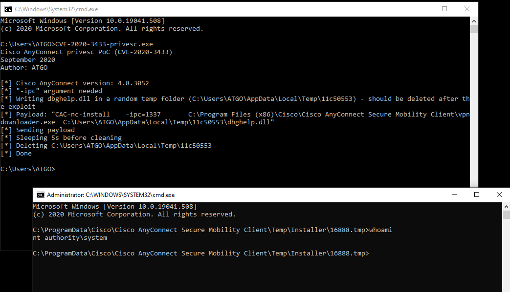
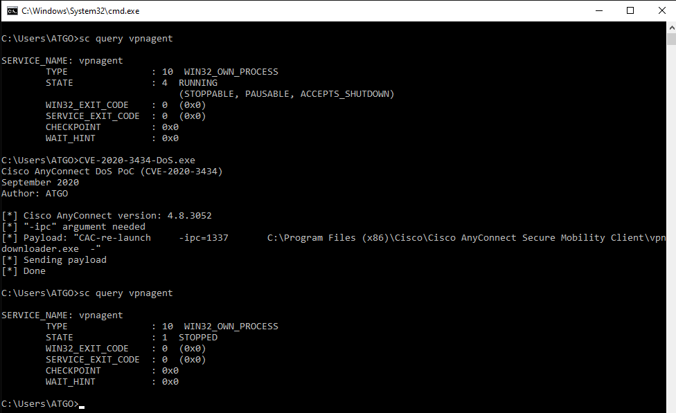
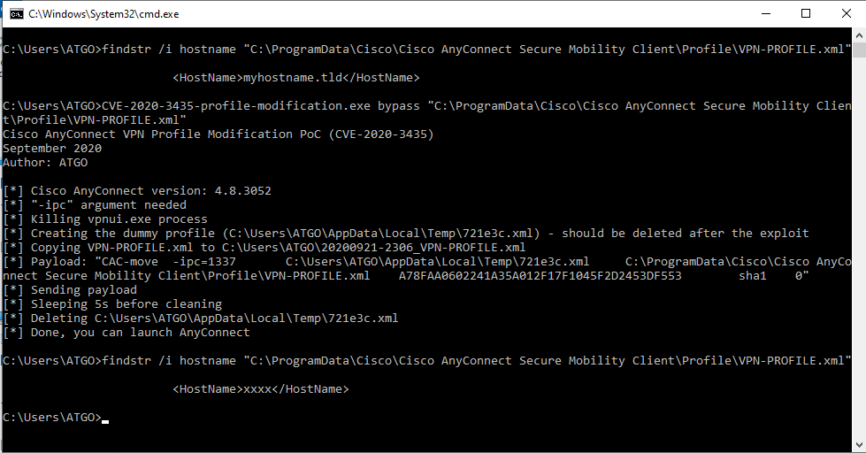

# PoCs for CVE-2020-3433, CVE-2020-3434, and CVE-2020-3435

PoCs and technical details for the three vulnerabilities found on Cisco AnyConnect Secure Mobility Client for Windows in May 2020:

- CVE-2020-3433 - High (CVSS Score 7.8) - a local privilege escalation
- CVE-2020-3434 - Medium (CVSS Score 5.5) - a Denial of Service
- CVE-2020-3435 - Medium (CVSS Score 5.5) - an "Always-On" bypass (VPN profile modification)

Technical details are available in this repository: [Details.md](Details.md)

## CVE-2020-3433: Privilege escalation (AnyConnect < 4.9.00086)

### Description
> A vulnerability in the interprocess communication (IPC) channel of Cisco AnyConnect Secure Mobility Client for Windows could allow an authenticated, local attacker to perform a DLL hijacking attack. To exploit this vulnerability, the attacker would need to have valid credentials on the Windows system.
> 
> The vulnerability is due to insufficient validation of resources that are loaded by the application at run time. An attacker could exploit this vulnerability by sending a crafted IPC message to the AnyConnect process. A successful exploit could allow the attacker to execute arbitrary code on the affected machine with SYSTEM privileges. To exploit this vulnerability, the attacker would need to have valid credentials on the Windows system.

[Cisco Advisory](https://tools.cisco.com/security/center/content/CiscoSecurityAdvisory/cisco-sa-anyconnect-dll-F26WwJW)

### Exploit
Run `CVE-2020-3433-privesc.exe`. A SYSTEM shell will spawn

## CVE-2020-3434: Denial of Service (AnyConnect < 4.9.01095)

### Description
> A vulnerability in the interprocess communication (IPC) channel of Cisco AnyConnect Secure Mobility Client for Windows could allow an authenticated, local attacker to cause a denial of service (DoS)condition on an affected device. To exploit this vulnerability, the attacker would need to have valid credentials on the Windows system.
>
> The vulnerability is due to insufficient validation of user-supplied input. An attacker could exploit this vulnerability by sending a crafted IPC message to the AnyConnect process on an affected device. A successful exploit could allow the attacker to stop the AnyConnect process, causing a DoS condition on the device. To exploit this vulnerability, the attacker would need to have valid credentials on the Windows system.

[Cisco Advisory](https://tools.cisco.com/security/center/content/CiscoSecurityAdvisory/cisco-sa-anyconnect-dos-feXq4tAV)

### Exploit
Run `CVE-2020-3434-DoS.exe`. AnyConnect's VPN Agent service will stop.

## CVE-2020-3435: VPN profile modification

### Description
> A vulnerability in the interprocess communication (IPC) channel of Cisco AnyConnect Secure Mobility Client for Windows could allow an authenticated, local attacker to overwrite VPN profiles on an affected device. To exploit this vulnerability, the attacker would need to have valid credentials on the Windows system.
>
> The vulnerability is due to insufficient validation of user-supplied input. An attacker could exploit this vulnerability by sending a crafted IPC message to the AnyConnect process on an affected device. A successful exploit could allow the attacker to modify VPN profile files. To exploit this vulnerability, the attacker would need to have valid credentials on the Windows system.

[Cisco Advisory](https://tools.cisco.com/security/center/content/CiscoSecurityAdvisory/cisco-sa-anyconnect-profile-7u3PERKF)

### Exploit
Run `CVE-2020-3435-profile-modification.exe bypass "C:\path\to\profile\to\overwrite.xml"`. The VPN profile will be overwritten (by a profile embedded in the PoC). A backup of the profile will be written in the current folder (with current date and time).

OR 

Run `CVE-2020-3435-profile-modification.exe restore "C:\path\to\profile.xml"`. `C:\path\to\profile.xml` will be restored (`C:\path\to\profile.xml will be copied` to `C:\ProgramData\Cisco\Cisco AnyConnect Secure Mobility Client\Profile\profile.xml`)

## Additional information
- These vulnerabilities were found after the analysis of the [CVE-2020-3153](https://www.securify.nl/advisory/SFY20200419/cisco-anyconnect-elevation-of-privileges-due-to-insecure-handling-of-path-names.html) vulnerability (my PoC and my notes are available here: [link](https://github.com/goichot/CVE-2020-3153))
- The outline of the C# code and the DLL source code are based on Google Project Zero PoC for CVE-2015-6305: [link](https://bugs.chromium.org/p/project-zero/issues/detail?id=460)
- I have not tested AnyConnect 64-bit versions. Path to `vpndownloader.exe` should probably be modified. 

Antoine Goichot - September 2020 

[GitHub](https://github.com/goichot) | [Twitter](https://twitter.com/AntoineGoichot) | [LinkedIn](https://www.linkedin.com/in/antoinegoichot)

